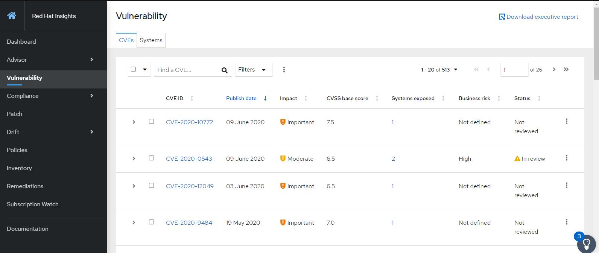

:scrollbar:
:data-uri:
:toc2:
:imagesdir: images

= RED HAT INSIGHTS: AUTOMATING REMEDIATIONS & FIXES

== Description
This Show&Tell is aimed to share some of the most important concepts and features of Insights and how we can automate remediations and fixes needed to get the platform to be stable, secure and in compliance.

Audience: IT Managers, Architects and technical staff who operates Linux

:numbered:

== Introduction
As existing workloads evolve and deployments grow in size and complexity, risk management is a key challenge for enterprise IT. To succeed, operations departments need to rapidly deploy new environments and ensure systems scale reliably. Red Hat® Insights helps customers benefit from the experience and technical knowledge of Red Hat Certified Engineers (RHCEs®) and makes it easier for users to identify, prioritize, and resolve issues before business operations are affected.

Red Hat Insights provides highly scalable, prescriptive analytics across complete, hybrid infrastructures. Red Hat Insights is also now included in all supported versions of Red Hat Enterprise Linux®, enabling users to proactively detect issues, enhance visibility into their deployments, improve security, and prescribe remediation through familiar tools like Red Hat Satellite.

Delivered as a Software-as-a-Service (SaaS) offering, Red Hat Insights takes advantage of Red Hat’s industry expertise as a leader in open source software to generate tailored remediations in real time.

Red Hat Insights uses intelligent data to pinpoint technical risks and help IT resolve problems before business is affected. This modern, integrated platform supports operational analytics and automated resolution across physical, virtual, container, and private and public cloud environments.

In the management equation not only exists the identification phase, but the remediation of the identified issues. Insights is intellegint enough to propose manual remediations, including step-by-step cookbooks to revolve a state that is not convenient for our platform. Nevertheless, in what Insights excels is how this tool propose those remediations in the automation realm. 

Insights is capable to propose playbooks for each remediation and fix proposed, that can be gathered and composed into more complex and rich playbooks to address several issues and servers at the same time, gaining more control over what needs to be acomplished to bring the platform from a current state to a needed one, without the intervention of the command line, which is prone to errors that in consequence raise the risks.

This Show & Tell is aimed to show you how we can, with the help of Insights and Ansible, remediate issues or fix states using the proposed playbooks by Insights. We will be visiting some procedures for addressing recommendations, vulnerabilities and compliance, so we can have the peace of mind that our platform is treated with proved automated procedures.

== How to install the client

The client for RHEL 8 is installed by default. In case other version (version>=6.4) the installation is pretty straightforward.

Before any installation you need to register the server with the appropriate subscription, which has to be active.

[source,bash]
---------------------
[root@server ~]# subscription-manager register --auto-attach
---------------------

The installation of the client is as follows . Remember to register the server to insights after the rpm installation.

*RHEL version < 8*

[source,bash]
---------------------
[root@server ~]# yum install redhat-access-insights
[root@server ~]#  redhat-access-insights --register
Automatic scheduling for Insights has been enabled.
Starting to collect Insights data for archimedes
Uploading Insights data.
Successfully uploaded report from archimedes to account xxxxxxxx.
---------------------

*RHEL version 8*

[source,bash]
---------------------
[root@server ~]# yum install insights-client
[root@server ~]#  insights-clients --register
Automatic scheduling for Insights has been enabled.
Starting to collect Insights data for archimedes
Uploading Insights data.
Successfully uploaded report from archimedes to account xxxxxxxx.
---------------------

The automated versions can be located at ansible or puppet links.

Is good practice to configure the servers you want to subscribe to insights through a https://access.redhat.com/solutions/1606693[proxy], so the server aren't exposed directly to a public connection. 

== Automating the Insights Installation

One of the very first thinks an administrator can automate with Insights is the installation and registration itself. As we saw in the previous section, we need to install the insights-client packacge and then register the server to the service. This procedure although ease means you hav to do the same towo actions on all the servers needed to be in the insights realm.

In this case, it is ease to automate the installation and registration of the service on any number of RHEL instances, and in this way we can also hide the differences of this procedure depending on the RHEL version we are dealing with.

What we need to have, and this is going to be a common requirement for all this Show & Tell, a RHEl server, which ideally can be RHEL 8 with Ansible engine installed. See the procedure in workshop called https://github.com/ltoRhelDemos/Workshops/tree/master/RHEL%20Automation%20with%20Ansible[Automating RHEL management with Ansible].

Having the ansible server as a control host it is time to install the RedHatInsights.insights-client role. 

[source,bash]
-----------------
ansible-galaxy install RedHatInsights.insights-client
-----------------

The role will be installed and it will be ready to use after this action.

Let's create a simple playbook that uses this role to install and register servers in an inventory. 

The playbook that follows could be named *install_insights.yml*

[source,bash]
-----------------
---
- name: Install and register Insights
  hosts: all
  roles:
  - role: RedHatInsights.insights-client
    when: ansible_os_family == 'RedHat'
-----------------

Let's create am inventory file called *hosts* which is going to following content. In our example we will install and register Insights in ONE server. The idea to use an Ansible role is automate this procedures on several or hundreds of servers at the same time.

[source,bash]
------------------------
[insights_servers]
192.168.56.102
------------------------

Now the execution part. In the control node, where we have created the playbook and the inventory file we need to execute the playbook.

[source,bash]
------------------------
ansible-playbook -i hosts install_insights.yml

PLAY [Install and register Insights] *************************************************

TASK [Gathering Facts] ***************************************************************
ok: [192.168.56.102]

TASK [RedHatInsights.insights-client : Install 'insights-client'] ********************
changed: [192.168.56.102]

TASK [RedHatInsights.insights-client : Set Insights Configuration Values] ************
ok: [192.168.56.102]

TASK [RedHatInsights.insights-client : Register Insights Client] *********************
changed: [192.168.56.102]

TASK [RedHatInsights.insights-client : Change permissions of Insights Config directory so that Insights System ID can be read] ***
ok: [192.168.56.102]

TASK [RedHatInsights.insights-client : Change permissions of machine_id file so that Insights System ID can be read] ***
ok: [192.168.56.102]

TASK [RedHatInsights.insights-client : Create directory for ansible custom facts] ****
changed: [192.168.56.102]

TASK [RedHatInsights.insights-client : Install custom insights fact] *****************
changed: [192.168.56.102]

PLAY RECAP ***************************************************************************
192.168.56.102             : ok=8    changed=4    unreachable=0    failed=0    skipped=0    rescued=0    ignored=0

------------------------

This is all we need to do for installing and registering Insights in a bunch of servers. It is very simple right?. 

As we are going to see, the remediation and fixes that Insights recommends are going to be easy too!... and that's the idea, having a tool that smash our issues in a way that the human intervention is minimal.

== Checking for Vulnerabilities

Insighs has a very useful functionality that takes care of the vulnerabilities found on servers registered to the server. In fact, this functionality itself is a tool that can be used to evaluate vulnerabilities, define statuses on those, create reports for reviewing threads and of course, having playbooks for automating the remediations.

And this is going to be our goal in this section. How to obtain the playbooks related to vulnerabilities and how to use them to remediate using Ansible our platform.

When we access the left panel of Insights, we surely can see an entry named Vulnerabilities. If we click on that item we should view a list of all vulnerabilities found in our registered platform. 

Every vulnerability is listed along with the published day, the impact, the CVSS score, the systems affected by the vulnerability, and also two additional columns that can be modified by us when necesary. IN this case we talk about a column named *Business Risk* and a column named *Status*.

These 2 columns are customizable. The "Business Risk" able us to define and describe the risk to the business if the issue (vulnerability) manifests itself in our server. This is a cool feature because we can determine and describe to others why the vulnerability needs to be address and remediated in terms of the risk to our business and services.

The columns Status complement the previous column because after describe the risks asociated with the vulnerability is good to document in which state is the review of the issue itself. We can choose among some options:

[source,bash]
------------------------
Not Reviewed
In Review
On Hold
Scheduled for patch
Resolved
No Action - Risk accepted
Resolved via Mitigation
------------------------

Using some of the listed options we can document the vulnerability in a complete way, so we can create reports that later can be reviewed for prioritizing and elevating for remediation approval in a change commitee.

Also, we can download an https://www.dropbox.com/s/80pwwdop54hqie8/Vulnerability-Executive-Report--14-Jul-2020-20_52_12-UTC.pdf?dl=0[executive report] that can be used for determining the level of risk at which our pltaform is exposed.

OK, now we need to aim to what matters in terms of automation. We have several ways to generate the playbooks that can help us to remediate the vulnerabilities.

- In the CVEs tab, on the Vulnerabilities item, we can check any vulnerability that we need to address to remediate using ansible. After checking the individual vulnerabilities a "Remediation Buttom" will be enabled so we can generate the playbook with all the plays related to each vulnerability.

- We also can use the selection pull down menu on the upper-left corner of the list to de-select, select a page or all the vulnerabilities in the list. 

In both cases we can automate the remediation to just a simple execution of the playbook genereted from ansible Tower or engine.

